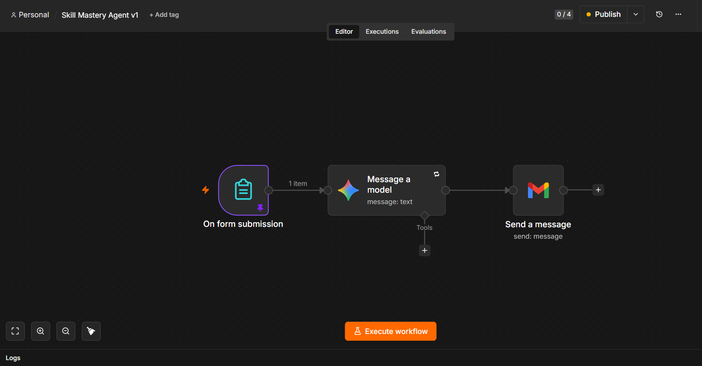

# 🎯 AI Skills Mastery Mentor: Automated HTML Blueprint Generator

A zero-touch, fully automated AI agent that transforms a simple form submission into a highly personalized, magazine-quality skill mastery roadmap in under 30 seconds.

(assets/Email Output.png)

## 🚀 Overview

Learning a new skill usually starts with sifting through generic advice and endless tutorials. I built this AI agent to generate instant, personalized roadmaps that calculate exactly how to reach mastery based on a user's specific motivation, current level, and time constraints.

Built entirely within a lean, 3-node n8n workflow, this project leverages Google Gemini 2.5 Flash as a dynamic backend rendering engine. By utilizing strict, template-driven prompting, the AI calculates learning timelines, dynamically scales CSS progress charts, and injects precise data into a hardcoded HTML skeleton delivered directly via the Gmail API.

## ⚙️ System Architecture

The workflow is elegantly simple, relying on advanced prompt engineering rather than complex code-splitting or regex parsing.

*   **The Trigger (n8n Webhook):** Captures user data (Name, Target Skill, Current Level, Weekly Time, Core Motivation) via a public form.
*   **The Brain (Gemini 2.5 Flash):** Acts as a rendering and calculation engine. It calculates realistic practice timelines, scales relative CSS percentages for bar charts, and dynamically shifts copywriting tone based on the user's motivation (e.g., framing for "Career" vs. "Hobby").
*   **The Action (Gmail API):** Receives pure, zero-markdown HTML from Gemini and instantly delivers the natively styled blueprint to the user's inbox.



## 🛠️ Tech Stack & Skills Highlighted

*   **Automation Platform:** n8n
*   **LLM Engine:** Google Gemini 2.5 Flash
*   **Delivery:** Gmail API (OAuth2)
*   **Frontend/Styling:** Inline CSS, HTML
*   **Core Concepts:** Template-Driven Prompting, Dynamic LLM Data Ingestion, Workflow Automation.

*(Read the full Prompt Architecture spec here)*

## 💻 How to Deploy This Workflow (Quick Start)

Want to run this agent yourself? The `workflow.json` file in this repository contains the complete logic structure. All API keys and personal credentials have been redacted for security.

### Prerequisites
*   An active n8n instance (Cloud or Self-Hosted).
*   A Google Gemini API Key (Google AI Studio).
*   A Gmail account.

### Installation Steps

1.  **Clone the repository:**
    ```bash
    git clone (https://github.com/Razorface1919/Skills-Mastery-Mentor-n8n/tree/main)
    ```
2.  **Import the Workflow:**
    *   Open your n8n workspace.
    *   Go to **Workflows** -> **Add Workflow**.
    *   Click the top-right menu (three dots) and select **Import from File**.
    *   Upload the `Skill Mastery Agent v1.json` file from this repo.
3.  **Configure Your Credentials:**
    *   Click on the **Gemini Node** (Message a model). Create a new credential and paste your actual Gemini API Key.
    *   Click on the **Gmail Node** (Send a message). Authenticate with your Google account via OAuth2.
4.  **Activate:**
    *   Toggle the workflow to **Active** in the top right corner.
    *   Double-click the Webhook/Form Node to get your public Production URL.
    *   Fill out the form and check your inbox!

## 🔐 Security Note

If you fork this repo and export your own n8n JSON files, always sanitize your exports. Search the `.json` file for your API keys and email addresses, and replace them with placeholder text (e.g., `YOUR_API_KEY_HERE`) before committing to GitHub.

## 🤝 Let's Connect

I'm transitioning my background in IT and data pipelines into the world of AI automation. If you're building AI agents, exploring n8n, or experimenting with prompt engineering, let's connect!

*   **LinkedIn:** (https://www.linkedin.com/in/shubham-singh-819967266)
